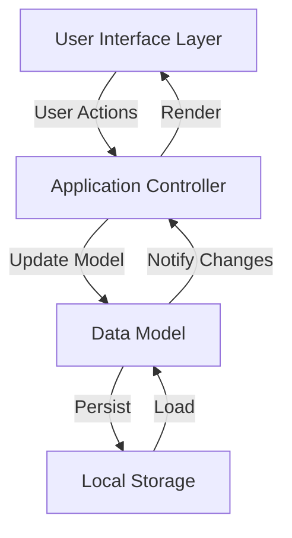
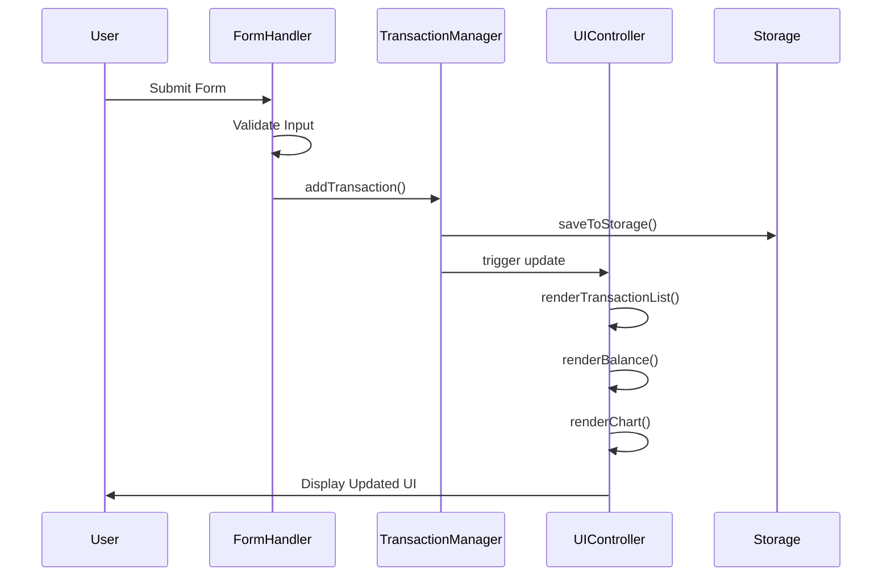

# Design Document: Expense & Budget Visualizer

## Overview

The Expense & Budget Visualizer is a client-side web application built with vanilla HTML, CSS, and JavaScript. The application follows a simple Model-View-Controller (MVC) pattern where the data model is persisted to browser Local Storage, the view is rendered through DOM manipulation, and the controller coordinates user interactions and updates.

The architecture prioritizes simplicity and performance, avoiding external dependencies while providing real-time updates across all UI components. The application uses a single-page design with four main visual sections: an input form, a transaction list, a balance display, and a pie chart visualization.

Key design principles:

- **Zero dependencies**: Pure vanilla JavaScript with no frameworks or libraries
- **Immediate feedback**: All UI updates occur synchronously within 100ms
- **Data integrity**: Local Storage serves as the single source of truth
- **Component isolation**: Each UI component has clear responsibilities and interfaces
- **Progressive enhancement**: Core functionality works without advanced browser features

## Architecture

### High-Level Architecture



### Application Structure

```
expense-budget-visualizer/
├── index.html          # Main HTML structure
├── css/
│   └── styles.css      # All application styles
└── js/
    └── app.js          # All application logic
```

### Architectural Layers

1. **Data Layer**: Manages transaction data and Local Storage persistence
2. **Business Logic Layer**: Handles transaction operations, calculations, and validation
3. **Presentation Layer**: Renders UI components and handles DOM updates
4. **Event Layer**: Manages user interactions and coordinates updates

## Components and Interfaces

### 1. TransactionManager (Data Layer)

Responsible for managing the collection of transactions and coordinating with Local Storage.

**Interface:**

```javascript
class TransactionManager {
  constructor()
  addTransaction(itemName, amount, category)
  deleteTransaction(id)
  getAllTransactions()
  getTransactionById(id)
  calculateTotal()
  getCategoryTotals()
  loadFromStorage()
  saveToStorage()
}
```

**Responsibilities:**

- Maintain in-memory array of transaction objects
- Generate unique IDs for new transactions
- Persist changes to Local Storage
- Provide aggregated data (totals, category breakdowns)

### 2. UIController (Presentation Layer)

Coordinates all UI updates and manages the rendering of components.

**Interface:**

```javascript
class UIController {
  constructor(transactionManager)
  init()
  renderTransactionList()
  renderBalance()
  renderChart()
  showValidationError(message)
  clearValidationError()
  clearForm()
}
```

**Responsibilities:**

- Render transaction list with delete buttons
- Update balance display
- Generate and update pie chart
- Display validation messages
- Clear form inputs

### 3. FormHandler (Event Layer)

Manages form submission and validation.

**Interface:**

```javascript
class FormHandler {
  constructor(transactionManager, uiController)
  init()
  handleSubmit(event)
  validateForm(itemName, amount, category)
  getFormData()
}
```

**Responsibilities:**

- Capture form submission events
- Validate input fields
- Coordinate transaction creation
- Trigger UI updates

### 4. ChartRenderer (Presentation Layer)

Generates the pie chart visualization using Canvas API or SVG.

**Interface:**

```javascript
class ChartRenderer {
  constructor(canvasElement)
  render(categoryTotals)
  clear()
  drawPieSlice(centerX, centerY, radius, startAngle, endAngle, color)
  drawLegend(categories)
}
```

**Responsibilities:**

- Calculate pie chart geometry
- Render chart segments with appropriate colors
- Display category labels and percentages
- Handle empty state

### Component Interaction Flow



## Data Models

### Transaction Object

```javascript
{
  id: string,           // Unique identifier (timestamp + random)
  itemName: string,     // Name of the expense item
  amount: number,       // Expense amount (positive number)
  category: string,     // One of: "Food", "Transport", "Fun"
  timestamp: number     // Creation timestamp (milliseconds since epoch)
}
```

**Validation Rules:**

- `id`: Auto-generated, must be unique
- `itemName`: Required, non-empty string after trimming
- `amount`: Required, must be a positive number
- `category`: Required, must be exactly one of the three valid categories
- `timestamp`: Auto-generated on creation

### Local Storage Schema

**Key:** `expense-tracker-transactions`

**Value:** JSON-serialized array of Transaction objects

```javascript
[
  {
    id: "1234567890-abc",
    itemName: "Lunch",
    amount: 12.5,
    category: "Food",
    timestamp: 1234567890000,
  },
  {
    id: "1234567891-def",
    itemName: "Bus Ticket",
    amount: 2.75,
    category: "Transport",
    timestamp: 1234567891000,
  },
];
```

### Category Configuration

```javascript
const CATEGORIES = {
  FOOD: {
    name: "Food",
    color: "#FF6B6B", // Red
  },
  TRANSPORT: {
    name: "Transport",
    color: "#4ECDC4", // Teal
  },
  FUN: {
    name: "Fun",
    color: "#FFE66D", // Yellow
  },
};
```

## Correctness Properties

_A property is a characteristic or behavior that should hold true across all valid executions of a system—essentially, a formal statement about what the system should do. Properties serve as the bridge between human-readable specifications and machine-verifiable correctness guarantees._

### Property 1: Valid Transaction Addition

_For any_ valid transaction data (non-empty item name, positive amount, valid category), submitting the form should result in the transaction appearing in the transaction list with all its details (item name, amount, category) displayed.

**Validates: Requirements 1.3, 1.4, 2.2**

### Property 2: Invalid Input Rejection

_For any_ form submission where at least one field is empty, the application should display a validation error and the transaction list should remain unchanged.

**Validates: Requirements 1.5, 1.6**

### Property 3: Form Clearing After Submission

_For any_ successful transaction creation, all form input fields should be cleared and ready for the next entry.

**Validates: Requirements 1.7**

### Property 4: Complete Transaction Display

_For any_ set of transactions in the data model, all transactions should appear in the rendered transaction list.

**Validates: Requirements 2.1, 2.4**

### Property 5: Transaction Deletion

_For any_ transaction that exists in the list, activating its delete control should remove it from both the displayed list and the data model.

**Validates: Requirements 2.5, 3.2**

### Property 6: Delete Control Presence

_For any_ transaction displayed in the list, a delete control should be present in its rendered output.

**Validates: Requirements 3.1**

### Property 7: Balance Calculation Accuracy

_For any_ set of transactions, the displayed balance should equal the sum of all transaction amounts.

**Validates: Requirements 4.1, 3.3**

### Property 8: Category Total Calculation

_For any_ set of transactions, the calculated total for each category should equal the sum of amounts for all transactions in that category.

**Validates: Requirements 5.2**

### Property 9: Chart Distribution Display

_For any_ set of transactions with spending across multiple categories, the pie chart should display a distinct segment for each category that has transactions, with segment sizes proportional to category totals.

**Validates: Requirements 5.1, 5.3, 3.4**

### Property 10: Storage Persistence Round-Trip

_For any_ set of transactions, saving them to Local Storage and then loading them back should produce an equivalent set of transactions with all data preserved (id, itemName, amount, category, timestamp).

**Validates: Requirements 6.1, 6.2, 6.3, 6.4, 6.5, 6.6**

### Edge Cases

**Empty State Handling**: When no transactions exist, the balance display should show zero and the chart should display an appropriate empty state.

**Validates: Requirements 4.4, 5.6**

### Examples

**Form Structure**: The rendered input form should contain exactly three fields: Item Name (text input), Amount (number input), and Category (select with exactly three options: Food, Transport, Fun).

**Validates: Requirements 1.1, 1.2**

## Error Handling

### Input Validation Errors

**Empty Field Validation:**

- Check all form fields before submission
- Display clear error message indicating which fields are required
- Prevent form submission until all fields are valid
- Error message should be dismissible or auto-clear on next valid input

**Invalid Amount Validation:**

- Ensure amount is a positive number
- Reject zero or negative values
- Reject non-numeric input
- Display specific error message for amount field issues

**Category Validation:**

- Ensure selected category is one of the three valid options
- Handle case where no category is selected
- Prevent form submission with invalid category

### Storage Errors

**Local Storage Unavailable:**

- Detect if Local Storage is disabled or unavailable
- Display warning message to user
- Allow application to function in memory-only mode
- Provide clear indication that data will not persist

**Storage Quota Exceeded:**

- Catch QuotaExceededError when saving
- Display error message to user
- Suggest deleting old transactions
- Prevent data loss by maintaining in-memory state

**Corrupted Storage Data:**

- Wrap JSON.parse in try-catch block
- Handle invalid JSON gracefully
- Clear corrupted data and start fresh
- Log error for debugging purposes

### Runtime Errors

**Chart Rendering Errors:**

- Validate canvas element exists before rendering
- Handle division by zero when calculating percentages
- Gracefully handle empty data sets
- Provide fallback if canvas is not supported

**DOM Manipulation Errors:**

- Verify elements exist before manipulation
- Use defensive programming for querySelector results
- Handle missing elements gracefully
- Provide console warnings for debugging

## Testing Strategy

### Overview

The testing strategy employs a dual approach combining unit tests for specific scenarios and property-based tests for comprehensive validation of universal behaviors. This ensures both concrete correctness and general robustness across all possible inputs.

### Property-Based Testing

**Framework:** fast-check (JavaScript property-based testing library)

**Configuration:**

- Minimum 100 iterations per property test
- Each test tagged with feature name and property reference
- Tag format: `Feature: expense-budget-visualizer, Property {number}: {property_text}`

**Property Test Coverage:**

1. **Transaction Addition Property Test**
   - Generate random valid transactions (arbitrary strings, positive numbers, valid categories)
   - Verify transaction appears in list with correct data
   - Tag: `Feature: expense-budget-visualizer, Property 1: Valid Transaction Addition`

2. **Invalid Input Rejection Property Test**
   - Generate random combinations of empty/missing fields
   - Verify error display and list unchanged
   - Tag: `Feature: expense-budget-visualizer, Property 2: Invalid Input Rejection`

3. **Form Clearing Property Test**
   - Generate random valid transactions
   - Verify form fields are empty after submission
   - Tag: `Feature: expense-budget-visualizer, Property 3: Form Clearing After Submission`

4. **Complete Display Property Test**
   - Generate random arrays of transactions
   - Verify all appear in rendered list
   - Tag: `Feature: expense-budget-visualizer, Property 4: Complete Transaction Display`

5. **Deletion Property Test**
   - Generate random transaction sets
   - Pick random transaction to delete
   - Verify removal from list and model
   - Tag: `Feature: expense-budget-visualizer, Property 5: Transaction Deletion`

6. **Delete Control Property Test**
   - Generate random transactions
   - Verify delete control in rendered output
   - Tag: `Feature: expense-budget-visualizer, Property 6: Delete Control Presence`

7. **Balance Calculation Property Test**
   - Generate random transaction sets
   - Verify balance equals sum of amounts
   - Tag: `Feature: expense-budget-visualizer, Property 7: Balance Calculation Accuracy`

8. **Category Total Property Test**
   - Generate random transaction sets
   - Verify category totals equal sum per category
   - Tag: `Feature: expense-budget-visualizer, Property 8: Category Total Calculation`

9. **Chart Distribution Property Test**
   - Generate random transaction sets with multiple categories
   - Verify chart has segments for each category
   - Verify segment proportions match totals
   - Tag: `Feature: expense-budget-visualizer, Property 9: Chart Distribution Display`

10. **Storage Round-Trip Property Test**
    - Generate random transaction sets
    - Save to storage, load back, verify equivalence
    - Tag: `Feature: expense-budget-visualizer, Property 10: Storage Persistence Round-Trip`

### Unit Testing

**Framework:** Jest or Mocha (standard JavaScript testing frameworks)

**Unit Test Focus Areas:**

1. **Specific Examples:**
   - Test form with specific known values (e.g., "Lunch", 12.50, "Food")
   - Test deletion of specific transaction
   - Test balance with known transaction set

2. **Edge Cases:**
   - Empty transaction list (balance = 0, empty chart)
   - Single transaction
   - Large amounts (test number formatting)
   - Very long item names (test truncation/display)
   - Maximum transactions (performance validation)

3. **Error Conditions:**
   - Local Storage unavailable
   - Corrupted JSON in storage
   - Invalid category value
   - Negative amount
   - Non-numeric amount

4. **Integration Points:**
   - Form submission flow (validation → creation → storage → display)
   - Deletion flow (UI click → model update → storage → display)
   - Load flow (storage → model → display all components)

5. **Component Isolation:**
   - TransactionManager operations without UI
   - ChartRenderer with mock data
   - FormHandler validation logic
   - UIController rendering with mock DOM

### Testing Balance

- Property tests handle comprehensive input coverage (100+ random cases per property)
- Unit tests focus on specific examples, edge cases, and integration scenarios
- Together they provide both breadth (property tests) and depth (unit tests)
- Avoid writing excessive unit tests for cases already covered by properties
- Unit tests should complement, not duplicate, property test coverage

### Browser Testing

**Manual Testing Required:**

- Visual verification in Chrome, Firefox, Edge, Safari
- Responsive behavior testing
- Performance validation (load time, update speed)
- Accessibility testing (keyboard navigation, screen readers)

**Automated Browser Testing (Optional):**

- Selenium or Playwright for cross-browser validation
- Visual regression testing for UI consistency
- Performance benchmarking

### Test Data Generators

For property-based testing, create generators for:

```javascript
// Arbitrary valid transaction
fc.record({
  itemName: fc.string({ minLength: 1 }),
  amount: fc.double({ min: 0.01, max: 10000 }),
  category: fc.constantFrom("Food", "Transport", "Fun"),
});

// Arbitrary invalid transaction (at least one empty field)
fc.oneof(
  fc.record({
    itemName: fc.constant(""),
    amount: fc.double(),
    category: fc.string(),
  }),
  fc.record({
    itemName: fc.string(),
    amount: fc.constant(null),
    category: fc.string(),
  }),
  fc.record({
    itemName: fc.string(),
    amount: fc.double(),
    category: fc.constant(""),
  }),
);

// Arbitrary transaction array
fc.array(validTransactionArbitrary, { minLength: 0, maxLength: 100 });
```

## Implementation Notes

### Technology Choices

**Chart Rendering:** Use HTML5 Canvas API for pie chart rendering. Canvas provides good performance and is well-supported across all target browsers. Alternative: SVG for better scalability, but Canvas is simpler for this use case.

**ID Generation:** Use combination of `Date.now()` and `Math.random()` for transaction IDs. Format: `${Date.now()}-${Math.random().toString(36).substr(2, 9)}`. This provides sufficient uniqueness for client-side application.

**Event Handling:** Use event delegation for delete buttons to improve performance with large transaction lists. Attach single listener to transaction list container rather than individual buttons.

### Performance Optimizations

**Debouncing:** Not required for this application since all operations are user-initiated and infrequent.

**Virtual Scrolling:** Not required unless transaction count exceeds 1000. Simple DOM rendering is sufficient for typical use cases.

**Batch Updates:** Group DOM updates together to minimize reflows. Update all components (list, balance, chart) in a single render cycle.

**Local Storage:** Keep in-memory copy of transactions to avoid repeated JSON parsing. Only read from storage on initial load.

### Browser Compatibility Considerations

**Local Storage:** Supported in all target browsers. Include feature detection and fallback message.

**Canvas API:** Supported in all target browsers. Include fallback message if not available.

**ES6 Features:** Use ES6 classes and arrow functions. All target browsers support ES6 in modern versions. Consider Babel transpilation if supporting older browser versions.

**CSS Grid/Flexbox:** Use for layout. Supported in all modern versions of target browsers.

### Accessibility Considerations

**Keyboard Navigation:** Ensure all interactive elements (form inputs, buttons) are keyboard accessible.

**ARIA Labels:** Add appropriate ARIA labels to form fields and buttons for screen readers.

**Focus Management:** Maintain logical focus order. Return focus to form after transaction creation.

**Color Contrast:** Ensure chart colors meet WCAG AA standards for color contrast.

**Alternative Text:** Provide text alternative for chart data (e.g., category totals list).

### Security Considerations

**XSS Prevention:** Sanitize user input before rendering to DOM. Use `textContent` instead of `innerHTML` for user-provided data.

**Input Validation:** Validate all inputs on client side. Ensure amount is numeric and positive.

**Storage Limits:** Handle storage quota gracefully. Don't assume unlimited storage.

### Future Enhancements

Potential features for future iterations:

- Export transactions to CSV
- Date range filtering
- Budget limits with warnings
- Multiple currency support
- Dark mode theme
- Transaction editing
- Category customization
- Search and filter functionality
